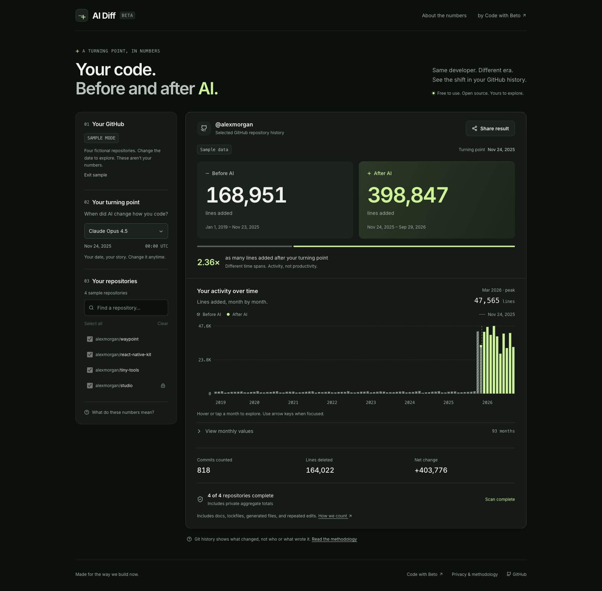

# AI Diff

Compare your GitHub activity before and after you started using AI. Connect GitHub, choose a date and repositories, then explore lines added, monthly activity, and a result you can share. Free to use and open source.

**[Open AI Diff →](https://aidiff.cwb.sh)** · by [Code with Beto](https://codewithbeto.dev)



*Fictional sample data.*

## How it works

- Discover public repositories you own or recently contributed to. Add a public organization to load its repositories, or add a repository by URL.
- Include private repositories through selected GitHub App installations. Private organization access may require an owner’s approval.
- Choose an AI release date or your own cutoff. Change the date and filters instantly after scanning. Repeated scans in the same tab reuse verified file details after checking current repository access and history.
- Explore additions, deletions, monthly activity, and individual commits and files. Copy or download a result image, or create a short public link with that image as its social preview.

AI Diff counts **lines added in default-branch commits whose primary author matches your GitHub account**. It excludes forks and merge commits, deduplicates commit SHAs, and splits the periods at midnight UTC.

By default, dependency lockfiles and checksums are removed first, then commits changing more than 100,000 remaining lines are skipped. The same filters apply to both periods and can be disabled. Documentation, other generated text, imports, and repeated edits still count. Commits whose files could not be fully inspected are omitted from filtered totals and marked incomplete; raw mode retains their known aggregate counts.

Results cover selected, accessible history. Automatic discovery does not include every organization you have worked in. These numbers measure commit activity, not AI authorship or productivity. [Read the methodology](https://aidiff.cwb.sh/about).

## Run locally

Use **Node.js 24 LTS** and npm:

```sh
git clone https://github.com/Code-with-Beto/ai-diff.git
cd ai-diff
npm ci
npm run dev
```

Open **http://127.0.0.1:5173** and try the sample report. No credentials are needed.

For real GitHub sign-in, follow [GitHub App configuration](README-backend.md#configuration). The app uses React, TypeScript, Vite, and a small Cloudflare Worker. Optional public links use Cloudflare KV. No repository cloning or AI API is required.

## Checks

```sh
npm test
npm run build
```

Run `npm run test:git` when changing counting logic. It checks the calculation against a controlled local Git history.

## Setup and privacy

See the [backend guide](README-backend.md) for configuration, API contracts, [deployment](README-backend.md#deploying-your-own-instance), and [privacy details](README-backend.md#privacy-and-sharing).

GitHub access is read-only. File inspection receives GitHub responses that may contain diff context; the Worker discards patches and returns only file metadata and line counts. Analysis stays in browser memory, and images are generated locally. **Create public link** stores only the aggregate summary and exact preview PNG. Anyone with the link can see them; sharing private totals requires explicit consent. File paths, repository names, and raw commits are left out. Downloads and long result links remain available if publishing reaches the free limits.

## Contributing

[Contributions](CONTRIBUTING.md) and [bug reports](https://github.com/Code-with-Beto/ai-diff/issues) are welcome. For security issues, follow [SECURITY.md](SECURITY.md).

Licensed under [MIT](LICENSE).

---

[Code with Beto](https://codewithbeto.dev) · [YouTube](https://cwb.sh/youtube) · [Sponsor](https://github.com/sponsors/betomoedano)
